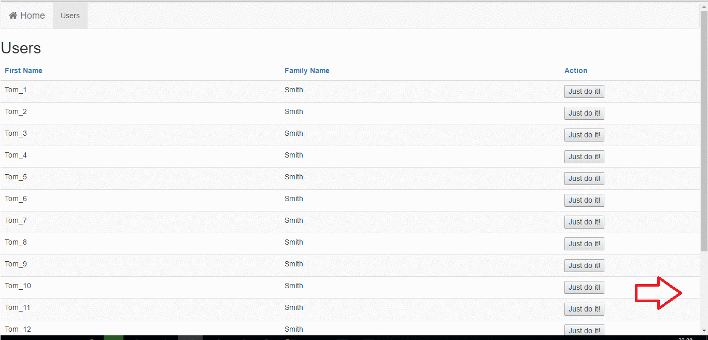

#### NPM package [aurelia-infinite-scroll](https://www.npmjs.com/package/aurelia-infinite-scroll)

## What is aurelia-infinite-scroll plugin?
aurelia-infinite-scroll is a plugin for [Aurelia](http://aurelia.io/) that adds feature of infinite browser scroll i.e. Facebook loading. When the bottom of the custom attribute container(i.e. div) reaches the bottom of the browser window, the plugin should invoke custom expression - function and this usually adds more elements to container presenting nice infinite loading. This feature is also great loading list elements on mobile devices using standard touch-pad scrolling.

aurelia-infinite-scroll has very similar functionality as [ngInfiniteScroll] (https://github.com/sroze/ngInfiniteScroll) and can be easily configured to integrate tables and div elements to providing infinite loading feeling.



# Installation prerequisites
Obviously, you need to have installed [NodeJs](https://nodejs.org/) and [Gulp](http://gulpjs.com/). aurelia-infinite-scroll was based on [Aurelia plugin](https://github.com/aurelia/skeleton-plugin) and requires only standard Aurelia libraries. It's highly recommended to use JSPM for package management.

# Installation
```
jspm install npm:aurelia-infinite-scroll
```
Using Npm:
```
npm install aurelia-infinite-scroll --save
```

# Usage guide

In your Aurelia configuration file(most commonly main file) add the plugin :
```js
import 'aurelia-infinite-scroll';

export function configure(aurelia: Aurelia) {
  aurelia.use
    .standardConfiguration()
    .developmentLogging()
    .plugin('aurelia-infinite-scroll');

  aurelia.start().then(() => aurelia.setRoot());
}
```

Then you can use custom attribute 'infinite-scroll' anywhere in the code like this for example:
```js
<template>
    <div class="some-container" infinite-scroll="callback.call: getData()">
    </div>
</template>
```

In the view-model provide function, that will be called each time window scroll reaches bottom of div 'some-container'.
```js
getData() {
	// i.e. Load more data and generate div's using repeater
}
```

There is the default **scroll buffer** of 50px used to call attribute expression before window reaches the real bottom of container to make loading elements smooth and sexy. You can also use **isActive** binding to switch off/on this plugin.
```js
<template>
    <div class="some-container" infinite-scroll="callback.call: getData(); scrollBuffer: 50; isActive: true ">
    </div>
</template>
```

Notice: you can use **only one** container with this custom attribute per particular page html due to window scroll, which is global.

## Browser support

This plugin should work with all modern browsers, although it is still in early phase and can contain few bugs. Current version was tested in IE11, Edge and Chrome. 
```
